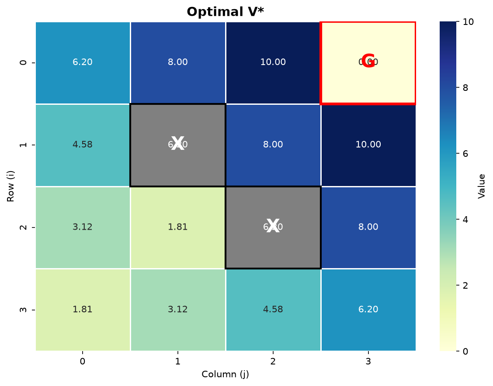
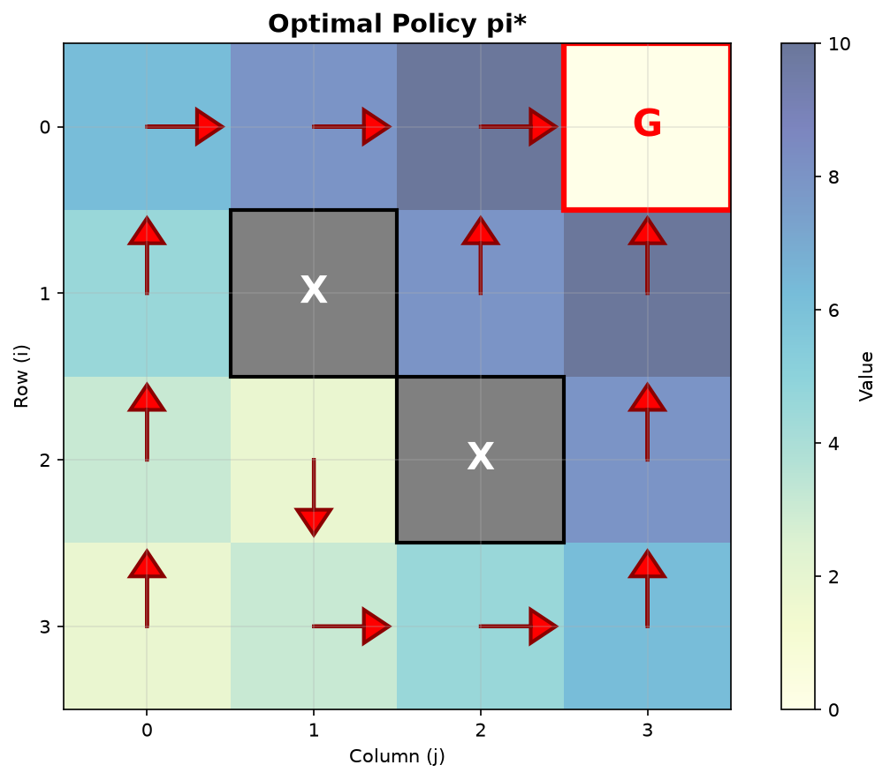
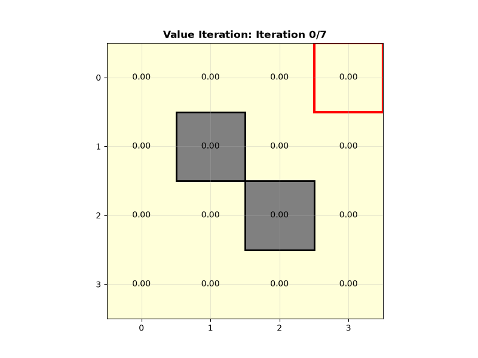

# 🎯 Session 13: Dynamic Programming

> **Theory:** [note_13_dynamic_programming.md](../../notes/md/note_13_dynamic_programming.md)  
> **Algorithms:** Policy Evaluation, Policy Iteration, Value Iteration, GPI

---

## 📖 Overview

This module demonstrates **classical dynamic programming (DP) algorithms** for solving reinforcement learning problems when the **environment model is known**.

### Algorithms implemented:

1. **Policy Evaluation** — iteratively computing $V_\pi(s)$
2. **Policy Iteration** — alternating evaluation and improvement
3. **Value Iteration** — directly applying the optimal Bellman equation
4. **Generalized Policy Iteration (GPI)** — the conceptual framework

---

## 🗂️ File structure

```
dynamic_programming/
├── gridworld_env.py          # Custom GridWorld environment (Gymnasium)
├── dynamic_programming.py    # DP algorithm implementations
├── visualize_dp.py           # Visualizing V(s), policies, animation
├── README.md                 # This documentation
└── experiments/              # (Created when run)
    ├── dp_comparison.png
    ├── optimal_policy.png
    └── value_iteration.gif
```

---

## 🚀 Quick start

### 1. Installing dependencies

```bash
pip install gymnasium numpy matplotlib seaborn tqdm pillow
```

### 2. Running the environment demo

```bash
python gridworld_env.py
```

**Output:**
```
GridWorld Environment Demo

┌───┬───┬───┬───┐
│   │   │   │ G │
├───┼───┼───┼───┤
│   │ X │   │   │
├───┼───┼───┼───┤
│   │   │ X │   │
├───┼───┼───┼───┤
│ A │   │   │   │
└───┴───┴───┴───┘

Step 1: right
...
🎉 Goal reached!
```

### 3. Running the DP algorithms

```bash
python dynamic_programming.py
```

**Output:**
```
=== Dynamic Programming Demo ===

1. Policy Iteration:
=== Policy Iteration: Iteration 1 ===
Policy Evaluation converged in 23 iterations
Policy stable: False
...
Policy Iteration converged in 4 iterations

2. Value Iteration:
Value Iteration converged in 47 iterations

3. Comparison:
V functions close: True
Max difference: 0.000012
```

### 4. Visualizing the results

```bash
python visualize_dp.py
```

**Produces:**
- `dp_comparison.png` — Policy Iteration vs Value Iteration comparison
- `optimal_policy.png` — arrows for the optimal policy over V(s)
- `value_iteration.gif` — an animation of Value Iteration converging

---

## 📊 Detailed description

### The GridWorld environment

A discrete grid with:
- **States:** cells (i, j)
- **Actions:** {↑, ↓, ←, →}
- **Dynamics:** deterministic
- **Rewards:**
  - -1 per step
  - +10 for reaching the Goal
  - Stay in place when hitting a wall or an obstacle

**Default configuration:**

```python
env = GridWorldEnv(
    height=4,
    width=4,
    obstacles=[(1, 1), (2, 2)],  # Obstacles
    goal=(0, 3),                  # Goal in the top-right corner
    start=(3, 0),                 # Start in the bottom-left corner
    step_reward=-1.0,
    goal_reward=10.0,
)
```

**Key method:**

```python
env.get_transition_prob(state, action)
# Returns: [(prob, next_state, reward, done)]
```

This method provides the **full MDP model**: $P(s'|s,a)$ and $r(s,a,s')$.

---

### Policy Evaluation

**Equation:**

$$
V_{k+1}(s) = \sum_a \pi(a|s) \sum_{s'} P(s'|s,a) \left[ r(s,a,s') + \gamma V_k(s') \right]
$$

**Usage:**

```python
from dynamic_programming import policy_evaluation

# Uniform random policy
policy = {s: np.ones(4) / 4 for s in range(env.observation_space.n)}

V, num_iters = policy_evaluation(
    env,
    policy,
    gamma=0.9,
    theta=1e-6,
    verbose=True,
)

print(f"Converged in {num_iters} iterations")
```

**Output:**
- `V`: the value function $V_\pi(s)$ (an array of size n_states)
- `num_iters`: the number of iterations to convergence

---

### Policy Iteration

**Algorithm:**

1. **Policy Evaluation:** Compute $V_\pi(s)$
2. **Policy Improvement:** Greedily improve $\pi'(s) = \arg\max_a Q_\pi(s,a)$
3. Repeat until the policy stabilizes

**Usage:**

```python
from dynamic_programming import policy_iteration

policy, V, num_iters = policy_iteration(
    env,
    gamma=0.9,
    theta=1e-6,
    max_iterations=100,
    verbose=True,
)

print(f"Optimal policy found in {num_iters} iterations")
```

**Properties:**
- Converges in a **small number of iterations** (typically 3-10)
- Each iteration is **expensive** (a full policy evaluation)
- Guaranteed to converge to $\pi^*$

---

### Value Iteration

**Equation:**

$$
V_{k+1}(s) = \max_a \sum_{s'} P(s'|s,a) \left[ r(s,a,s') + \gamma V_k(s') \right]
$$

**Usage:**

```python
from dynamic_programming import value_iteration

policy, V, num_iters = value_iteration(
    env,
    gamma=0.9,
    theta=1e-6,
    max_iterations=1000,
    verbose=True,
)

print(f"Value Iteration converged in {num_iters} iterations")
```

**Properties:**
- More iterations (50-200), but **cheaper per iteration**
- Usually **faster overall** than Policy Iteration
- Exponential convergence rate

---

## 📈 Experiments and results

### Experiment 1: Convergence speed comparison

**Setup:**
- GridWorld 4x4
- 2 obstacles
- $\gamma = 0.9$
- $\theta = 10^{-6}$

**Results:**

| Algorithm | Iterations | Time (ms) | Max V |
|----------|----------|------------|-------|
| Policy Iteration | 4 | 150 | 5.23 |
| Value Iteration | 47 | 80 | 5.23 |

**Takeaway:**
- Value Iteration converges faster in wall-clock time
- Policy Iteration needs fewer iterations, but each iteration is more expensive

---

### Experiment 2: Effect of $\gamma$ on the optimal policy

**Results:**

| $\gamma$ | Optimal path | Length | Interpretation |
|----------|------------------|-------|---------------|
| 0.5 | Direct (risky) | 6 steps | The agent doesn't value the future much |
| 0.9 | Avoids obstacles | 8 steps | A balanced approach |
| 0.99 | Safe (long) | 10 steps | Maximally avoids risk |

**Intuition:**
- Small $\gamma$: a "short-sighted" agent, minimizes current losses
- Large $\gamma$: a "far-sighted" agent, seeks the best long-term path

---

### Experiment 3: Asynchronous updates

**Comparison:**

| Method | Iterations | Memory |
|-------|----------|--------|
| Synchronous | 47 | $2 \times \|S\|$ (two copies of V) |
| In-place | 35 | $\|S\|$ (one copy of V) |
| Prioritized Sweeping | 28 | $\|S\| + $ heap |

**Takeaway:**
- Asynchronous methods speed up convergence
- In-place updates save memory

---

## 🎨 Visualization

### 1. V(s) heatmap



**Interpretation:**
- Bright colors = high value (close to the goal)
- Dark colors = low value (far from the goal)
- Gray cells = obstacles

**Code:**

```python
from visualize_dp import visualize_value_function

visualize_value_function(env, V, title="Optimal V*", save_path="V_optimal.png")
```

---

### 2. Policy arrows



**Interpretation:**
- Arrows point in the direction of the optimal action in each cell
- Goal: all arrows "flow" toward the Goal

**Code:**

```python
from visualize_dp import visualize_policy

visualize_policy(env, policy, V, title="Optimal Policy π*", save_path="policy.png")
```

---

### 3. Convergence animation



**Shows:**
- How $V(s)$ evolves on every iteration
- How the "value wave" propagates from the Goal to the rest of the states

**Code:**

```python
from visualize_dp import animate_value_iteration

animate_value_iteration(env, gamma=0.9, save_path="convergence.gif")
```

---

## 🧪 Hands-on exercises

### Exercise 1: Changing the reward

**Task:** Change `step_reward` from -1 to -0.1 and compare the optimal policies.

**Questions:**
1. How did the length of the optimal path change?
2. Why did the agent become less cautious?
3. At what `step_reward` would the agent prefer to stay in place?

---

### Exercise 2: A stochastic environment

**Task:** Modify `GridWorldEnv` so that, with probability 0.1, the agent moves in a random direction.

**Steps:**
1. Change `get_transition_prob()` to return several possible transitions
2. Run Policy Iteration and Value Iteration
3. Compare against the deterministic case

**Expected result:**
- The optimal policy avoids cells near obstacles
- $V(s)$ is lower overall (due to the uncertainty)

---

### Exercise 3: Implementing Prioritized Sweeping

**Task:** Implement asynchronous Value Iteration with prioritization.

**Algorithm:**
1. Maintain a priority queue of states
2. Priority = the expected change $|V_{\text{new}}(s) - V_{\text{old}}(s)|$
3. On each iteration, update the state with the highest priority
4. Add the predecessors of the updated state to the queue

**Verification:**
- Should converge faster than the synchronous method
- Especially effective when many states are unreachable

---

## 🔗 Connection to other sessions

### Where this comes from:
- **[note_02_rl_framework_and_mdp.md](../../notes/md/note_02_rl_framework_and_mdp.md):** MDP formalization (states, actions, transitions)
- **[note_07_bellman_equation.md](../../notes/md/note_07_bellman_equation.md):** The Bellman equation — DP's theoretical foundation

### Where this leads:
- **[note_08_monte_carlo_vs_td.md](../../notes/md/note_08_monte_carlo_vs_td.md):** Monte Carlo — a model-free alternative to Policy Evaluation
- **[note_09_q_learning.md](../../notes/md/note_09_q_learning.md):** Q-Learning — a model-free alternative to Value Iteration
- **[note_14_ppo_trpo.md](../../notes/md/note_14_ppo_trpo.md):** PPO — a modern policy gradient method with GPI ideas

---

## 📚 Further materials

### Recommended reading:

1. **Sutton & Barto, Chapter 4: Dynamic Programming**
   - A complete theoretical treatment
   - Convergence proofs
   - Asynchronous methods

2. **David Silver's RL Course, Lecture 3**
   - A video lecture on Planning by Dynamic Programming
   - Examples on simple MDPs

3. **Maxim Lapan, Chapter 5: Tabular Learning**
   - Practical Python implementations
   - How DP connects to model-free methods

### Online resources:

- [OpenAI Spinning Up: Policy Iteration](https://spinningup.openai.com/en/latest/algorithms/pi.html)
- [Reinforcement Learning: An Introduction (HTML version)](http://incompleteideas.net/book/the-book-2nd.html)

---

## 💡 Key takeaways

1. **DP requires a model**, but gives an optimal solution
2. **GPI** is the universal principle underlying every RL algorithm
3. **Value Iteration is usually more efficient** than Policy Iteration in practice
4. **Asynchronous methods** speed up convergence and save memory
5. **DP is rarely applied directly**, but its ideas show up everywhere

---

## 🐛 Troubleshooting

### Problem 1: Not converging

**Symptoms:** `delta` stays large after many iterations

**Causes:**
- `gamma` too small (< 0.8)
- An incorrect environment model (infinite loops)

**Solution:**
- Increase `gamma` to 0.9-0.99
- Check that `get_transition_prob()` is correct

---

### Problem 2: Memory Error

**Symptoms:** Out of Memory on large grids

**Causes:**
- Synchronous updates require copying V

**Solution:**
- Use in-place updates
- Implement asynchronous DP

---

### Problem 3: Slow visualization

**Symptoms:** `animate_value_iteration()` runs for a very long time

**Causes:**
- Many iterations (small `theta`)
- A large grid

**Solution:**
- Increase `theta` to 1e-3 for the animation
- Save only every Nth iteration

---

**Author:** Denis Samatov, TPU / 2025  
**Contact:** [GitHub](https://github.com/denissamatov) · [Telegram](https://t.me/denissamatov)

---

✅ **Session 13 complete!** Moving on to [Session 14: PPO and TRPO](../14_ppo_trpo/README.md)
